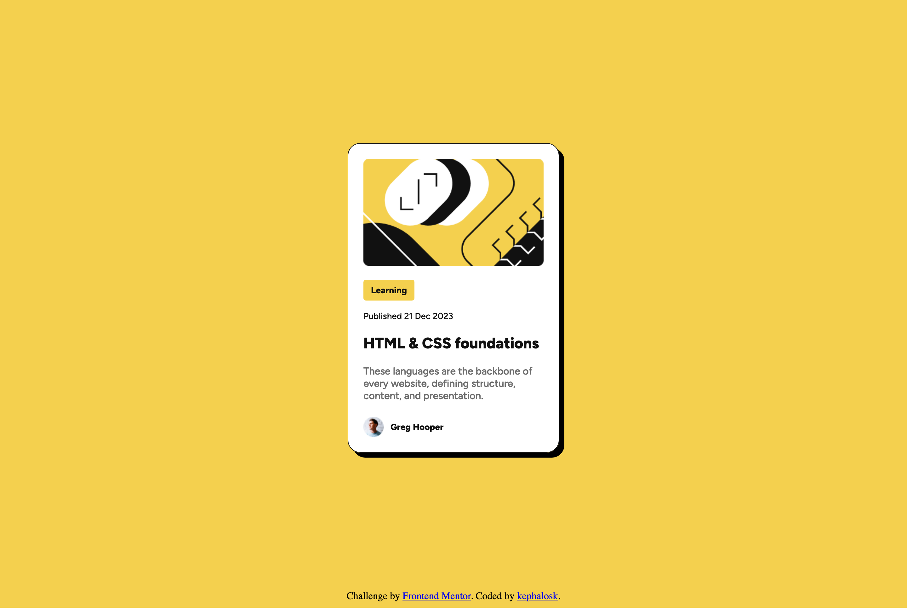
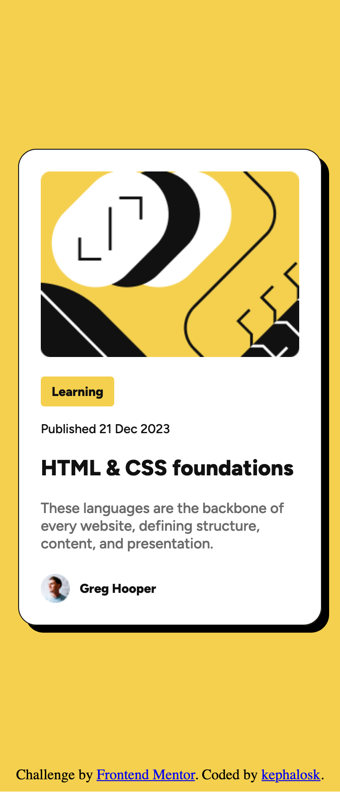
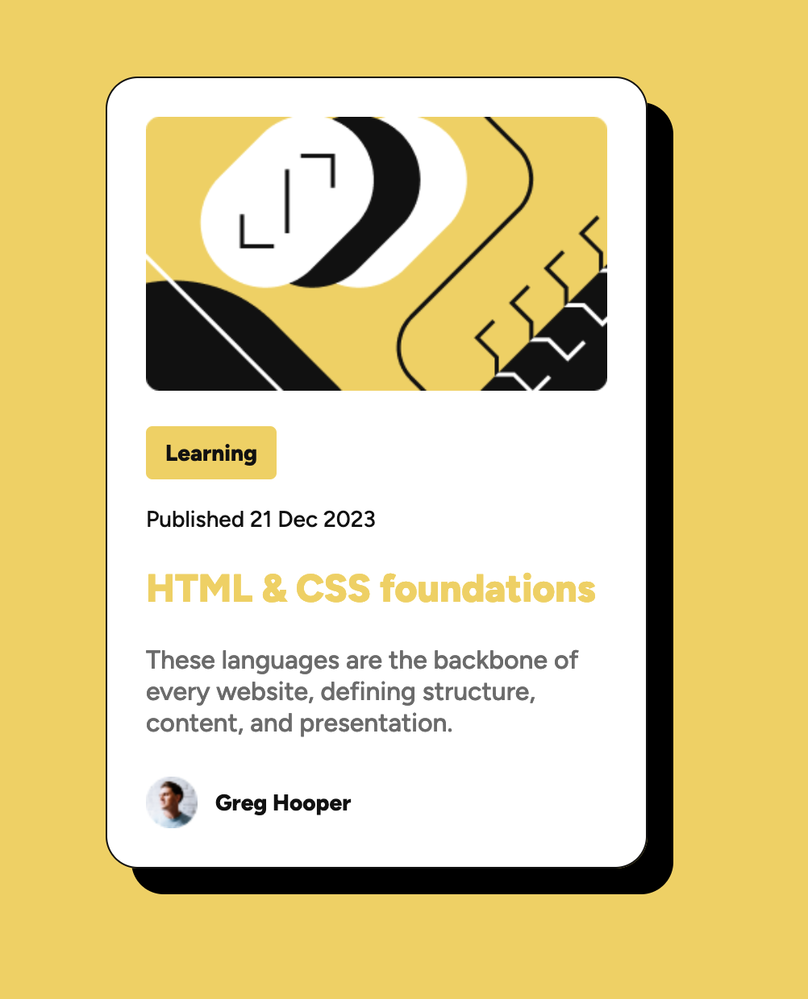

# Frontend Mentor - Social links profile solution

This is a solution to the [Blog preview card challenge on Frontend Mentor](https://www.frontendmentor.io/challenges/blog-preview-card-ckPaj01IcS/hub). Frontend Mentor challenges help you improve your coding skills by building realistic projects. 

## Table of contents

- [Overview](#overview)
  - [Screenshot](#screenshot)
  - [Links](#links)
- [My process](#my-process)
  - [Built with](#built-with)
  - [What I learned](#what-i-learned)
  - [Continued development](#continued-development)
  - [Useful resources](#useful-resources)
- [Author](#author)
- [Acknowledgments](#acknowledgments)


## Overview

### Screenshot

Desktop


Mobile


Active State


### Links

- Solution URL: [Add solution URL here](https://github.com/kephalosk/blog-preview-card-figma)
- Live Site URL: [Add live site URL here](https://kephalosk.github.io/blog-preview-card-figma/)

## My process

1. download Project


2. move Project to target folder


3. open Project in IDE


4. read README


5. add .gitignore-file


6. check files


7. check design


8. initialize repo
* create repo on GitHub
* git remote add origin git@github.com:kephalosk/blog-preview-card-figma.git
* git push -u origin master

9. check html
* build general structure
* open index.html in browser for comparison

10. check css
* image styling
* font styling
* color styling
* frame styling
* spacing styling

11. check transitions


12. check mobile/responsive design


13. check accessability
* semantic html
* headings
* alternative texts
* language
* clear language
* link texts

14. add screenshots


15. update README

### Built with

- Semantic HTML5 markup
- CSS custom properties
- Desktop-first workflow

### What I learned

I learned to integrate custom fonts from the asset folder:
```css
@font-face {
  font-family: "Outfit";
  src: url('assets/fonts/Figtree/static/Figtree-ExtraBold.ttf') format('truetype');
  font-weight: bold;
}
```

I learned that you can include the padding of an element to its width with box-sizing:
```css
* {
  box-sizing: border-box;
}
```

I learned how easy it is to set a box shadow:
```css
main {
  border: 1px solid #111111;
  border-radius: 20px;
  box-shadow: 8px 8px #000000;
}
```

I learned to make smooth transitions even for nested child elements:
```css
main {
  box-shadow: 8px 8px #000000;
  transition: box-shadow 0.3s ease;
}

main:hover {
  box-shadow: 16px 16px #000000;
}

main h1 {
  transition: color 0.3s ease;
}

main:hover h1 {
  color: #F4D04E;
}
```

I learned to use different pictures for different screensizes:
```html
<picture>
  <source srcset="assets/images/blog_image_mobile.png" media="(max-width: 450px)">
  <source srcset="assets/images/blog_image_desktop.png" media="(min-width: 451px)">
  
</picture>
```

### Continued development

* improve html
* improve css

### Useful resources

- [w3schools](https://www.w3schools.com/) - HTML and CSS knowledge
- [selfhtml](https://wiki.selfhtml.org/wiki/HTML) - HTML knowledge

## Author

- Website - [kephalosk](https://easywebpath.com)
- Frontend Mentor - [@yourusername](https://www.frontendmentor.io/profile/yourusername)
- Twitter - [@yourusername](https://www.twitter.com/yourusername)

## Acknowledgments

None.